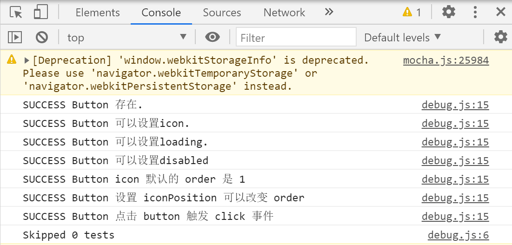
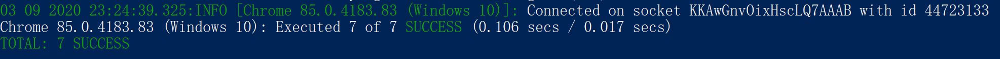

# 按钮篇

## 设计细节
1. 高度最好为**8**的倍数，此处设置为**32px**；
如果要支持大小类型的按钮，可设置为**24px**(**small**)和**40px**(**large**)
2. 按钮不设置固定宽度，左右`padding`设置为**1em**，表示左右各留一个字的空间
3. 因为`button`设置为`inline-flex`布局，在多个按钮并列时会存在位置不对齐的问题，
使用`vertical-align: middle`解决

## 功能细节
1. 支持icon的设置
比较常见的场景是icon在文案左边或者右边，这个可以通过传入一个`iconPosition`为**left**或**right**来决定，
一开始的想法是通过`v-if`来决定显示哪一行：
```vue
<button>
  <yv-icon v-if="iconPosition === 'left'"></yv-icon>
  <div class="button-content"></div>
  <yv-icon v-if="iconPosition === 'right'"></yv-icon>
</button>
```
但是这种做法有点low，也多了一行没必要的重复代码，然后想到`flex`有一个`order`的属性，可以决定子元素布局的排列优先级，`template`修改成如下：
```vue
<template>
    <button class="yv-button" :class="{[`icon-${iconPosition}`]: true}">
      <div class="button-content">
        <slot></slot>
      </div>
      <yv-icon class="icon"></yv-icon>
    </button>
</template>
<style scoped lang="scss">
  .yv-button {
    > .button-content {
      order: 2;
    }
    > .icon {
      order: 1;
    }
    &.icon-right {
      > .button-content {
        order: 1;
      } 
      > .icon {
        order: 2;
      } 
    } 
  }
</style>
```
一开始设置icon的`order`为**1**表示默认icon是在左边，当用户传了`iconPosition`为**right**时，就会给`button`加上
`icon-right`的**class**名，这时icon的`order`设置为**2**，`content`的`order`设置为**1**，这样在不修改代码的情况下，通过`order`的值就可以设置icon的显示位置

2. 支持loading的设置
因为loading也要有图标，所以需要处理loading时不出现其它图标的情况，增加一个判断条件：
```vue
<button>
  <div class="button-content">
    <slot></slot>
  </div>
  <yv-icon class="icon" v-if="icon && !loading" :name="name"></yv-icon>
  <yv-icon class="loading icon" v-if="loading" name="loading"></yv-icon>
</button>
```

3. 让loading的图标动起来
因为**iconfont**上面的图标都是静态的，而loading是要动起来的，所以要怎么操作呢？
仔细想一下，loading就是360°不断地旋转，那我们只要写一个旋转的动画处理就可以，如下：
```css
@keyframes spin{
  0% {transform: rotate(0deg)}
  100% {transform: rotate(360deg)}
}

.loading {
  animation: spin 1s infinite linear;
}
```

4. 按钮组合
按钮组合应该让按钮衔接看起来顺滑一点，这里采取的默认方案是按钮紧挨，然后第一个按钮和最后一个按钮的边缘钝化，同时中间的按钮应向前靠**1像素**，因为`button`都有`border`，看起来会很粗。代码如下：
```vue
<style scoped lang="scss">
$button-radius: 4px;
.yv-button-group {
  display: inline-flex;
  vertical-align: middle;
  .yv-button {
    border-radius: 0;
    &:not(:first-child) {
      margin-left: -1px;
    }
    &:first-child {
      border-bottom-left-radius: $button-radius;
      border-top-left-radius: $button-radius;
    }
    &:last-child {
      border-top-right-radius: $button-radius;
      border-bottom-right-radius: $button-radius;
    }
  }
}
</style>
```

## 人工测试
手动测试。。。已完成

## 自动化测试
在**test**文件夹下增加`button.test.js`文件
主要增加**7**个测试用例，分别是：**测试button是否存在**、**设置icon**、**icon初始位置**、**设置icon位置**、**设置loading**、**设置disabled**、**click点击事件**

运行`npm run dev-test`命令，是配置在package.json文件中的该命令：`parcel watch test/* --no-cache & karma start`，就是监听、打包test文件夹下的*.test.js文件，然后运行karma开始自动化测试，测试结果可在浏览器控制台查看：



或者powershell面板查看：



## vuepress配置
在**docs/.vuepress/components**文件夹下增加`button-demo`的vue文件，内容就是我们要展示的`button`示例，然后在**docs/components**文件夹下增加`button`的md文件，内容就是放置整个`button`组件说明。

具体内容请访问https://ysom.github.io/yvue-ui/components/button.html#%E7%A4%BA%E4%BE%8B