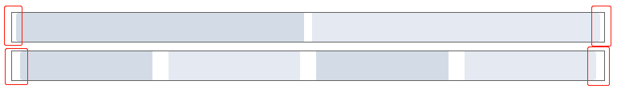

# 布局篇

## 设计细节
1. `row`组件默认采用`flex`布局，可通过`left`、`center`、`right`来设置对齐方式；
2. `row`组件可通过设置`gutter`参数来设置列之间的间隔；
3. `col`组件可通过设置`span`参数来设置不同列数，默认将宽度分为**24**列，同时可搭配`offset`参数来设置分栏偏移数；
4. 响应式布局传递的参数不采用`element-ui`那些`xs`、`sm`参数，字面上不利于理解，
所以这里采用了`phone`、`iPad`、`narrowPC`和`widePC`等参数来分别表示在屏幕大小为
手机、平板、窄屏PC端和宽屏PC端下的展示。

## 功能处理细节
1. `span`设置分栏数。默认将页面宽度分成了24等分，再通过`span/24`来算出分栏的占比，那要怎么设置各占比分栏宽度呢？
如果直接通过`yv-col-1 ~ 24`这样写24个类名，就会出现一堆重复的代码，维护、改动也麻烦。幸好可以通过**css预处理器**来处理这种情况，**预处理器**可以像JS那样写变量，函数，
可以为我们提供很多方便的操作，这里采用了`scss`来处理：
```scss
@for $n from 1 through 24 {
  $class-prefix: yv-col-;
  &.#{$class-prefix}#{$n} {
    width: ($n / 24) * 100%
  }
}
```
先设置通用前缀`yv-col-`，再通过for循环从1到24，算出每一份的宽度，这样就可以根据`span`的值得到对应的类名`yv-col-n`从而得到对应的宽度。

2. `gutter`传参问题。设置分栏间隔是通过在`row`组件上面传递`gutter`参数，但实际上我们还得靠处理`col`组件来实现。一开始直接像下面这样直接把`gutter`传个每个`col`
```vue
<yv-row :gutter="10">
  <yv-col :gutter="10"></yv-col>
  <yv-col :gutter="10"></yv-col>
</yv-row>
```
这样看起来很不友好。这里可以使用父子组件通信的另一种方法：`$parent`和`$children`。如下：
```vue
<!-- Row.vue -->
mounted() {
  this.$children.forEach(child => {
    child.gutter = this.gutter
  })
}

<!-- Col.vue -->
data() {
  return {
    gutter: 0
  }
}
```
在`row`的生命周期`mounted`中通过`$children`给每个子组件的`gutter`属性赋值，同时`col`组件也要在`data`里面定义`gutter`属性

3. `gutter`具体设置问题。一开始的想法是直接给每一列的左右加上`gutter/2`的外边距，但是这会跟通过`offset`设置的偏移分栏外边距产生冲突。
那么换成内边距如何呢？试下内边距的效果。

从图片可以发现最左边跟最右边的分栏没有紧挨父级容器，这是因为设置了内边距的原因。解决方案是给父级容器加上`-gutter/2`的左右外边距，就ok了。

4. 响应式处理。这里采用了`phone`、`iPad`、`narrowPC`、`widePC`这种直观的字段来表示不同屏幕宽度。通过createClasses方法来创建不同的类名
```vue
computed: {
  colClass() {
    let {
      span,
      offset,
      phone,
      iPad,
      narrowPC,
      widePC
    } = this
    return [
      'yv-col',
      ...this.createClasses(phone, 'phone-'),
      ...this.createClasses(iPad, 'iPad-'),
      ...this.createClasses(narrowPC, 'narrowPC-'),
      ...this.createClasses(widePC, 'widePC-'),
      ...this.createClasses({ span, offset })
    ]
  }
},

methods: {
  createClasses(obj, str = '') {
    if (!obj) return []
    let arr = []
    if (obj.span) {
      arr.push(`yv-col-${str}${obj.span}`)
    }
    if (obj.offset) {
      arr.push(`yv-col-${str}offset-${obj.offset}`)
    }
    return arr
  }
}
```
设置一个计算属性col
