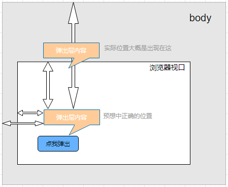

# 弹出框篇

## 设计细节
1. 触发方式。可设置通过`trigger`属性设置**点击click**或者**覆盖hover**触发弹出框。同时通过点击触发的弹出框，再次点击或者点击页面其它地方，将会关闭该弹出框，但点击弹出框区域不关闭。
2. 弹出位置。可通过`position`属性设置弹出位置，有**顶部top**、**底部bottom**、**左侧left**和**右侧right**。

## 功能细节

1. 弹出层元素层级。遇到的第一个坑，弹出层的容器是放在popover里面的，看下结构：

   ```vue
   <template>
   	<div class='yv-popover' ref="popover">
           <div class="content-wrapper">
             <slot name="content"></slot>
           </div>
           <span ref="triggerWrapper">
             <slot></slot>
           </span>
     </div>
   </template>
   ```

   如果popover的父容器设置了`overflow: hidden`的样式值，弹出层的内容就会被隐藏。解决方案就是让弹出层放在body里面而不是popover里面，这样弹出层就不会受到popover父级和父级以上元素的影响。

2. 弹出层的定位值。这是继第一个坑之后的坑。弹出层是设置了绝对定位，在它出现在body里面之前，它是相对于popover容器定位，出现在body里面之后，就是相对于body定位，所以坑就出现了，如果当前位置超过了当前视口的大小而出现了滚动条，弹出层出现的位置一直是相对于body的位置而不能精准出现在当前视口，看下图示：

   

   从图示可以看到popover弹出层出现的位置并没有在浏览器视口中，解决方案就是需要加上滚动条的高度，即`window.scrollY`，同理，左边需要加上`window.screenX`，具体的设置请看**弹出位置设置**。

3. 设置弹出层的位置。这里不管弹出位置在上下还是左右，都通过top和left来设置位置，所以写成一个对象，到时通过传入值来匹配：

   ```javascript
   let positions = {
   	top: {
           top: '',
           left: ''
       },
       bottom: {
           // ...
       },
       left: {
           // ...
       },
       right: {
           // ...
       }
   }
   ```

   顶部位置就是一开始的设置：

   ```javascript
   top: {
       top: top + window.scrollY,
       left: left + window.screenX,
   }
   ```

   底部位置：由于是出现在content底部，所以top值还需要加上content本身的高度：

   ```javascript
   bottom: {
       top: top + height + window.scrollY,
       left: left + window.screenX
   }
   ```

   左侧位置和右侧位置：一般两个元素并列居中展示会看着比较舒服，如果让弹出层和content层居中展示呢？将top值加上用两个元素之间的差值除以2的值，得到的就是弹出层的位置：
   
   ```javascript
   left: {
       top: top + window.scrollY + (height - contentHeight) / 2,
       left: left + window.screenX
   }
   ```
   
   同时由于在右侧弹出，所以右侧的left值还需加上content的宽度：
   
   ```javascript
   right: {
       top: top + window.scrollY + (height - contentHeight) / 2,
       left: left + width + window.screenX
   }
   ```
   
   上面所用到的left、width等均来自：
   
   ```javascript
   const { contentWrapper, triggerWrapper } = this.$refs
   let { width, height, left, top } = triggerWrapper.getBoundingClientRect()
   let { height: contentHeight } = contentWrapper.getBoundingClientRect()
   ```
   
   然后根据用户传进来的`position`位置属性值，给弹出层`contentWrapper`赋值：
   
   ```javascript
   contentWrapper.style.top = positions[this.position].top + 'px'
   contentWrapper.style.left = positions[this.position].left + 'px'
   ```
   
   最后还有优化的地方，即给弹出层加上一个小尾巴，这个属于CSS范畴且样式代码比较多，同样也是要分成上下左右四部分设置，看源码即可。

4. 触发方式的处理。点击方式通过给**document**添加**click**监听事件，这里有个点需要注意，如果是给**body**添加**click**监听，有可能会出现因为body**高度不够**而点击不到的问题。**hover**触发方式是通过给`popover`添加**mouseenter**和**mouseleave**监听事件。

   ```vue
   <script>
     export default {
       mounted() {
         if (this.trigger === 'click') {
         	this.$refs.popover.addEventListener('click', (e) => {
             this.showPopover(e)
           })
         } else {
             this.$refs.popover.addEventListener('mouseenter', () => {
               this.open()
             })
             this.$refs.popover.addEventListener('mouseleave', () => {
               this.close()
             })
           }
         }
     }
    </script>
   ```

   


## vuepress配置

