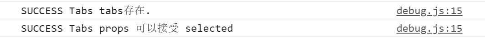

# 标签页篇

## 设计细节
1. 结构分明。为了让结构层次更明显，在`tabs-head`里面有子组件`tabs-item`，在`tabs-body`里面有子组件`tabs-pane`，表示各自的标签与内容。

   但结构分明的同时也有些许缺陷，就是`tabs-item`和`tabs-pane`都要加上相同的`name`属性，对于喜欢“偷懒”的程序猿来说，多写一遍属性是比较麻烦的事情。

## 功能细节

1. 组件通信。由于存在爷 -> 父 -> 孙组件的通信，为了让通信更方便，使用`provide`和`inject`。

2. 事件通信。还是上面的原因，为了让多层组件的通信更简单，这里使用了事件总线eventBus，通过new一个vue实例，将这个实例通过provide传递，inject接收，来实现组件之间的事件通信。

   ```vue
   // tabs.vue
   
   import Vue from 'vue'
   export default {
     name: "YvTabs",
     provide() {
       return {
         eventBus: this.eventBus
       }
     },
   	// ...
     data() {
       return {
         eventBus: new Vue()
       }
     },
   	// ...
   }
   ```

## 人工测试
手动测试。。。已完成。

## 自动化测试
在**test**文件夹下增加`tabs.test.js`和`tabs-item.test.js`文件。

因为`tabs-pane`和`tabs-item`基本一致，这里就不再做自动化测试了。

`tabs.test.js`文件有2个测试用例：**测试tabs是否存在**、**接收selected**；

`tabs-item.test.js`文件有4个测试用例：**测试tabs-item是否存在**、**接收name**、**接收disabled**、**点击事件**。  

运行命令`parcel watch test/* --no-cache`和`karma start`查看测试结果：




## vuepress

在**docs/.vuepress/components**文件夹下增加多个`tabs-demo`的vue文件，内容就是我们要展示的`tabs`示例，然后在**docs/components**文件夹下增加`tabs`的md文件，内容就是放置整个`tabs`组件说明。

具体内容请[访问这里](https://ysom.github.io/yvue-ui/components/tabs.html)。