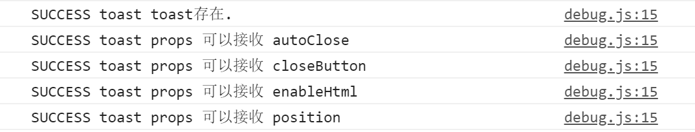

# 提示框篇

## 设计细节
1. 兼容性设计。在设计关闭提示框按钮的时候，有考虑要如何实现：如果是一个关闭图标，在移动端的交互体验会有点差，因为图标太小，手指有可能很难点击命中；所以将关闭区域设置得稍微大一点，在提示文案的右边区域作为关闭点击区域，同时支持设置点击回调函数。

2. 方向设置。可设置提示框的弹出方向，按时钟顺序包括：上、右、下、左、中。

3. 自动关闭。可设置自动关闭以及关闭的时间。

## 功能设计
1. 开发为插件。对于toast的定位就是有点击等操作时可以通过`this.$toast`直接调用toast，一开始的想法是直接在`Vue.prototype`上添加，但是这种方案有弊端，就是无法确定`Vue.prototype.$toast`能不能直接用，会不会已经被用户设置成其它的，所以这样的修改的决定权还是得交给用户，因此我们可以采用[vue的插件机制](https://cn.vuejs.org/v2/guide/plugins.html)来完成这件事情：

   ```javascript
   export default {
     install(Vue, options) {
       Vue.prototype.$toast = function(toastOptions) {
         // ...
       }
     }
   }
   ```

2. 动态创建。使用`this.$toast`的时候可以生成toast组件，包含了指定的内容，然后挂载到页面中，同时还要兼容处理页面中同时只能有一个toast，如果生成之前已经有了toast组件，需要先销毁：

   ```javascript
   // plugin.js
   let currentToast
   
   export default {
     install(Vue, options) {
       Vue.prototype.$toast = function(toastOptions) {
         if (currentToast) {
           currentToast.onClose()
         }
         currentToast = createToast({
           Vue,
           propsData: toastOptions,
           onClose: () => {
             currentToast = null
           }
         })
       }
     }
   }
   
   function createToast({ Vue, propsData, onClose }) {
     const Constructor = Vue.extend(Toast)
     const toast = new Constructor({ propsData })
     toast.$slots.default = [propsData.message]
     toast.$mount()
     toast.$on('close', onClose)
     document.body.appendChild(toast.$el)
     return toast
   }
   ```

   ```vue
   <!-- Toast.vue -->
   <script>
     export default {
       name: "YvToast",
       methods: {
         // ...
         onClose() {
           this.$el.remove()
           this.$emit('close')
           this.$destroy()
         }
       }
     }
   </script>
   ```

3. 设置toast出现动画。这里有个坑，就是toast 动画中的属性 `transform: translate()` 在使用了 fixed 绝对定位后与 `transform: translate()` 发生了冲突，解决方案是在toast外套一层wrapper负责fixed定位，toast自身负责动画：

   ```scss
   @keyframes pushToast-top {
      0% {opacity: 0;transform: translateY(-100%)}
      100% {opacity: 1;transform: translateY(0)}
   }
   @keyframes pushToast-bottom {
      0% {opacity: 0;transform: translateY(100%)}
      100% {opacity: 1;transform: translateY(0)}
   }
   @keyframes pushToast-middle {
      0% {opacity: 0;}
      100% {opacity: 1;}
   }
   @keyframes pushToast-left {
      0% {opacity: 0;transform: translateX(-100%)}
      100% {opacity: 1;transform: translateY(0)}
   }
   @keyframes pushToast-right {
      0% {opacity: 0;transform: translateX(100%)}
      100% {opacity: 1;transform: translateY(0)}
   }
   
   .wrapper {
       position: fixed;
       z-index: 9999;
       &.toast-position-top {
          left: 50%;
          top: 10px;
          transform: translateX(-50%);
          .yv-toast {
            animation: pushToast-top .3s;
          }
       }
       &.toast-position-right {
           right: 10px;
           top: 50%;
           transform: translateY(-50%);
           .yv-toast {
               animation: pushToast-right .3s;
           }
       }
       &.toast-position-bottom {
           bottom: 10px;
           left: 50%;
           transform: translateX(-50%);
           .yv-toast {
               animation: pushToast-bottom .3s;
           }
       }
       &.toast-position-left {
           left: 10px;
           top: 50%;
           transform: translateY(-50%);
           .yv-toast {
               animation: pushToast-left .3s;
           }
       }
       &.toast-position-middle {
           top: 50%;
           left: 50%;
           transform: translate(-50%, -50%);
           .yv-toast{
               animation: pushToast-middle 1s;
           }
       }
    }
   ```
   
## 人工测试
手动测试。。。已完成。

## 自动化测试
在**test**文件夹下增加`toast.test.js`文件。

`toast.test.js`文件有2个主测试用例：**测试toast是否存在**、以及**接收props**；

接收props有4个测试用例：**测试autoClose**、**测试closeButton**、**测试enableHtml**、**测试position**。  

运行命令`parcel watch test/* --no-cache`和`karma start`查看测试结果：



## vuepress设置

在**docs/.vuepress/components**文件夹下增加`toast-basic`和`toast-close`vue文件，内容就是我们要展示的`toast`示例，然后在**docs/components**文件夹下增加`toast`的md文件，内容就是放置整个`toast`组件说明。

具体内容请[访问这里](https://ysom.github.io/yvue-ui/components/toast.html)。